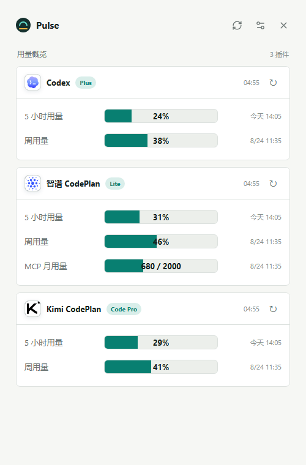
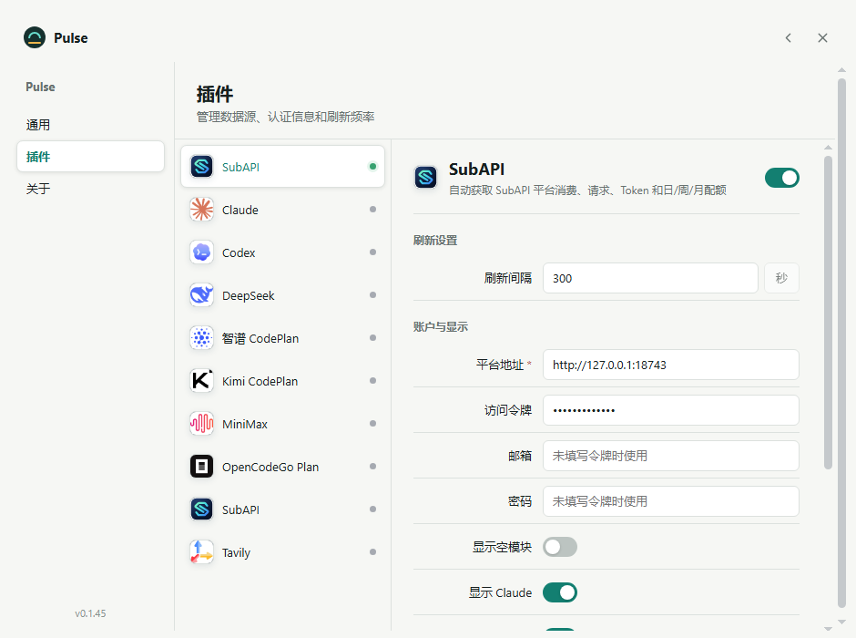

# Pulse for Windows

Pulse 是一款 Windows 托盘用量面板，用于集中查看 AI 编程订阅和 API 平台的配额。界面采用简洁、安静的 Pulse 原生风格，并自动跟随 Windows 浅色或深色模式。

## 界面预览

### 多平台用量概览



### 插件与展示模块设置



> 截图中的平台地址、余额和用量均为本地演示数据，不代表真实账户或服务。

## 内置数据源

- Claude：支持官方 Claude 登录、5 小时与周用量、本地 token 统计。
- Codex：支持官方 Codex 设备登录、订阅用量与本地 token 统计。
- 智谱 CodePlan、Kimi CodePlan、MiniMax Coding Plan。
- OpenCodeGo Plan。
- SubAPI（兼容 Sub2API 服务）：自动读取平台消费、请求、Token 与日/周/月额度，可手动选择展示平台并默认隐藏空模块。
- DeepSeek、Tavily。

## 功能

- 系统托盘常驻、开机启动和定时刷新。
- 分组或标签页概览。
- 折线图或堆叠柱图统计。
- 中英文界面，自动跟随 Windows 浅色或深色模式。
- 内置 Python、Codex CLI 与 Claude CLI，无需另外安装运行环境。
- 配置与旧版 UsageBoard 共用 `%APPDATA%\UsageBoard`，升级不会丢失数据。

## 开发

```powershell
cd windows
npm install
npm run python:prepare
npm test
npm start
```

## 构建

```powershell
cd windows
npm run dist
```

输出为 Windows x64 安装版和便携版。详细信息见 [windows/README.md](windows/README.md)。

## 项目来源与致谢

Pulse for Windows 基于 [marsmay/UsageBoard](https://github.com/marsmay/UsageBoard) 开源项目进行 Windows 二次开发，延续了 UsageBoard 的插件协议、用量聚合方式和多数据源设计思路。在此感谢 UsageBoard 作者及所有贡献者提供的开源代码与项目基础。

本项目在上游基础上完成了 Windows 桌面端适配、系统托盘与开机启动、内置 Python/Codex CLI/Claude CLI、Windows 官方登录流程、SubAPI 平台模块以及 Pulse 风格界面。界面视觉与交互灵感来自 Pulse 风格设计，并针对 Windows 10/11 的使用习惯进行了调整。

本项目遵循上游 MIT 许可证，是社区维护的非官方 Windows 二次开发版本，不代表 UsageBoard 上游作者或相关平台提供方发布的官方客户端。

## 免责声明

- Pulse 是独立开源项目，与 OpenAI、Anthropic、智谱 AI、月之暗面、MiniMax、OpenCodeGo、SubAPI/Sub2API 及其他数据源提供方不存在隶属、授权或背书关系。相关名称和商标归各自权利人所有。
- 本项目依赖第三方接口和本地 CLI 输出，平台升级、接口调整或账户权限变化可能导致数据延迟、缺失或功能不可用。额度、消费和账单信息应以对应平台的官方页面为准。
- API Key、访问令牌及插件参数保存在本机 `%APPDATA%\UsageBoard`。请妥善保护该目录，不要将其中的 `config.json`、插件副本、状态文件或日志提交到 Git、上传到公开位置或发送给他人。
- 使用第三方 API、代理平台或兼容服务时，请自行确认其服务条款、数据处理方式和安全性。因账号、密钥、费用、数据或服务中断产生的风险由使用者自行承担。
- 本软件按 MIT 许可证“按原样”提供，不承诺适用于任何特定用途，也不对使用本软件造成的直接或间接损失承担责任。

## 许可证

[MIT](LICENSE)
